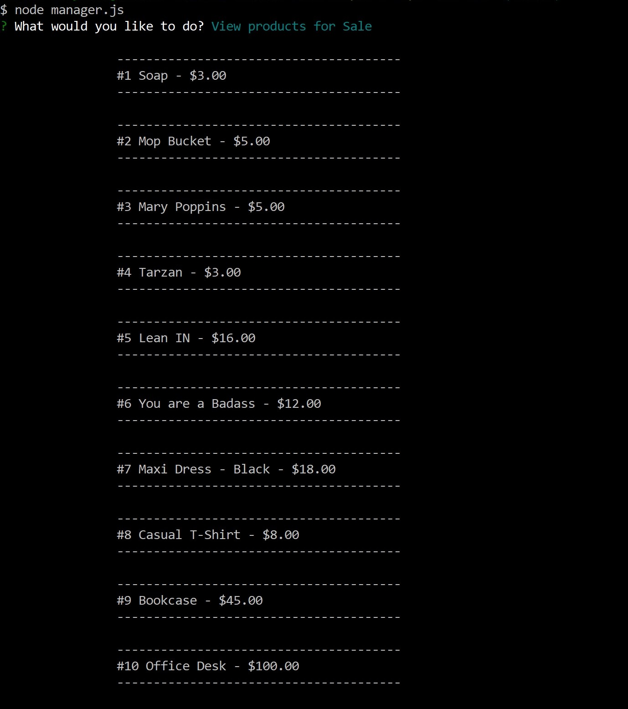
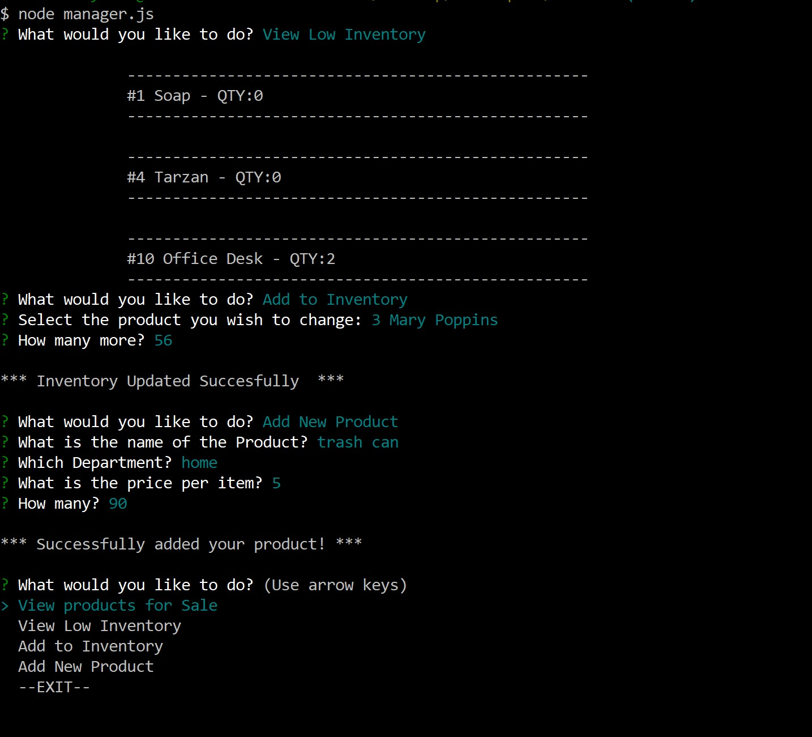

# Node.js & MySQL

## Overview

This is an Amazon-like storefront with MySQL. The app will take in orders from customers and deplete stock from the store's inventory. The app uses MySQL and Inquirer npm packages  for data input and storage.
 
## Customer View
  
* This view allows customers to view products and buy quantity entered

## Manager View

  * Menu Options

    * View Products for Sale
    
    * View Low Inventory
    
    * Add to Inventory
    
    * Add New Product

  * If a manager selects `View Products for Sale`, the app displays all iteRems: the item IDs, names, prices, and quantities.

  * If a manager selects `View Low Inventory`, lists all items which have an inventory count lower than five.

  * If a manager selects `Add to Inventory`, the app displays a prompt that will let the manager "add more" of any item currently in the store.

  * If a manager selects `Add New Product`, it allows the manager to add a completely new product to the store.
  
  * Video Demonstration: https://drive.google.com/file/d/1lWH0FLh21CQ3nSe3T177Bvzy3Sc1ef0H/view
  

